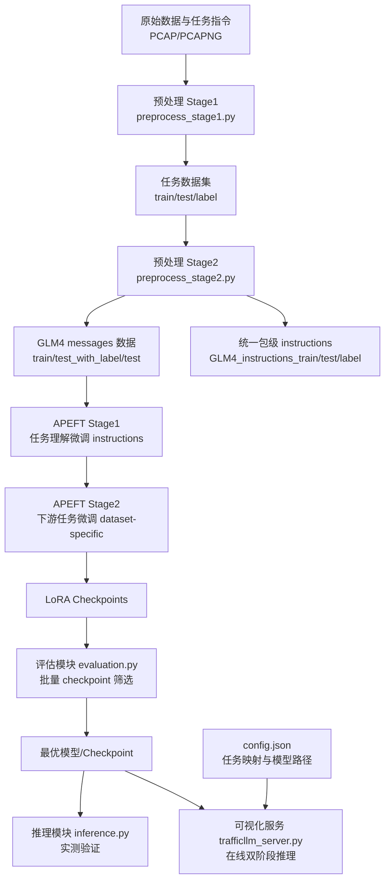

# TrafficLLM 项目说明

> 对 ZGC-LLM-Safety 的 TrafficLLM 进行增强

TrafficLLM 是一个面向网络流量智能分析的多任务大语言模型系统，围绕加密流量场景构建了从数据处理、参数高效微调、模型评估到在线服务的完整工程闭环。项目基于 GLM-4 系列基座模型，采用 LoRA/PEFT 方式实现低成本适配，支持多类安全任务统一建模与部署。

## 一、项目内容与创新点

### 1.1 项目内容

本项目实现了一个可落地的网络流量多任务学习框架，覆盖以下核心任务：

- MTD: Malware Traffic Detection（恶意软件流量检测）
- BND: Botnet Detection（僵尸网络检测）
- WAD: Web Attack Detection（Web 攻击检测）
- AAD: APT Attack Detection（APT 攻击检测）
- EVD: Encrypted VPN Detection（加密 VPN 流量识别）

系统由以下能力组成：

- 数据两阶段预处理：原始流量/指令样本 -> 统一训练测试集 -> GLM4 messages 格式
- 两阶段微调训练：任务理解（Stage1）+ 下游任务适配（Stage2）
- 自动化评估筛选：支持单模型与批量 checkpoint 评估及约束筛选
- 实测推理模块：面向已选模型进行独立推理验证与指标统计
- 可视化服务模块：基于 Streamlit 的双阶段在线推理交互

### 1.2 项目创新点

- 双阶段推理架构（Task Routing + Task Expert）
  - 阶段一先理解用户自然语言需求并完成任务路由。
  - 阶段二调用对应任务专用 LoRA 适配器进行细粒度判别。
  - 相比单模型硬分类方式，更适合多任务并行扩展。

- APEFT 两阶段训练编排
  - 将“指令能力学习”与“数据集任务适配”拆分，降低任务间相互干扰。
  - 自动跳过已完成 Stage1，支持快速增量训练新数据集。

- 面向工程落地的评估与筛选机制
  - 支持批量遍历 `checkpoint-*`，按最小准确率/精确率/召回率约束筛选。
  - 在满足约束条件下自动选择最优 F1 checkpoint，便于部署决策。

- 统一数据接口与格式标准化
  - 将多源流量任务统一转换为 GLM4 对话格式（messages），
  - 同时保留带标签/去标签测试集，兼顾评估和真实推理场景。
  - 自动构建统一包级 instructions 数据集（train/test/label）。

## 二、整体框架与模块说明

### 2.1 整体框架



### 2.2 框架流程说明

- 数据构建层
  - 从原始流量出发，构建多任务训练/测试样本并标准化为 GLM4 messages。

- 训练适配层
  - Stage1 学习任务识别能力。
  - Stage2 按具体数据集学习任务专用流量判别能力。

- 评估与部署层
  - 通过统一评估脚本完成 checkpoint 批量筛选。
  - 将最优模型用于离线推理与在线服务。

### 2.3 模块细分

#### 1) 数据预处理模块（preprocess/）

职责：将原始输入转换为可训练、可评估的标准数据。

- `preprocess_stage1.py`
  - 构建 `detection/generation/understanding` 任务数据。
  - 输出 `*_train.json`、`*_test.json` 与 `*_label.json`（检测任务）。
- `preprocess_stage2.py`
  - 将 Stage1 数据转换为 GLM4 `messages` JSONL。
  - 生成 `*_test_with_label.jsonl`（评估）与 `*_test.jsonl`（推理）。
  - 基于 5 个检测数据集生成统一包级 instructions 数据：
    - 训练集每类抽样 4000 条
    - 测试集每类抽样 500 条
    - 输出 `datasets/instructions/GLM4_instructions_train.jsonl`
    - 输出 `datasets/instructions/GLM4_instructions_test_with_label.jsonl`
    - 输出 `datasets/instructions/GLM4_instructions_test.jsonl`
    - 输出 `datasets/instructions/instructions_label.json`
- `flow_data_preprocess.py`、`packet_data_preprocess.py`
  - 分别负责流级/包级特征抽取。

输入：数据集目录、任务配置、指令样本。  
输出：标准化训练测试集与标签映射。

#### 2) APEFT 训练编排模块（APEFT/ + FT/）

职责：组织两阶段 PEFT 训练流程，生成任务专用 LoRA 权重。

- `APEFT/apeft.py`
  - 一键串行执行 Stage1 + Stage2。
  - 支持自动跳过已完成 Stage1 与可用数据集枚举。
- `FT/finetune.py`
  - 训练主逻辑（数据处理、trainer、指标计算）。
- `FT/train_stage1.sh`、`FT/train_stage2.sh`
  - 训练命令封装与日志管理。

输入：GLM4 messages 数据、训练 YAML 配置。  
输出：LoRA checkpoints 与训练日志。

#### 3) 评估模块（evaluation.py + evaluation/）

职责：统一进行检测任务指标评估与 checkpoint 优选。

- 支持检测任务指标：Accuracy、Precision、Recall、F1、混淆矩阵、分类报告。
- 支持批量评估 `checkpoint-*` 并按约束条件筛选最优模型。
- 评估结果写入 `evaluation/*_batch_eval_results.json` 与指标文本。

输入：模型/检查点、带标签测试集、label 映射。  
输出：最优 checkpoint 信息与完整评估报告。

#### 4) 推理模块（inference/）

职责：对已选模型进行真实推理验证。

- `inference.py`
  - 自动识别基座模型或 LoRA adapter 加载方式。
  - 执行逐条推理并输出分类指标。
- `inference.sh`
  - 一键运行与日志落盘。

输入：模型路径、去标签测试集、带标签测试集、label 映射。  
输出：推理指标文件与运行日志。

#### 5) 在线服务模块（trafficllm_server.py）

职责：提供可视化双阶段推理服务。

- 阶段一：读取用户指令并识别下游任务。
- 阶段二：根据任务映射加载对应 LoRA，完成流量判别。
- 支持页面参数调节：`max_length`、`top_p`、`temperature`。

输入：用户自然语言指令 + 流量特征文本。  
输出：下游任务识别结果 + 最终预测结果。

#### 6) 测试数据生成模块（generate_test_data.py + generated_test_data/）

职责：为演示场景自动构建两阶段联动测试样本。

- 按任务与标签均衡采样生成演示数据。
- 样本输入仅保留 `user_input.traffic_data`，两个阶段共用同一条流量文本。
- 输出包含阶段一期望任务与阶段二期望答案，便于联调展示。

## 三、项目目录总览

```text
TrafficLLM/
├── preprocess/                                    # 两阶段数据预处理模块
│   ├── preprocess_stage1.py                       # 阶段一：原始 pcap/pcapng -> instruction/output 数据集
│   ├── preprocess_stage2.py                       # 阶段二：转 GLM4 messages + 生成统一 instructions 数据集
│   ├── flow_data_preprocess.py                    # 流级特征提取（flow bytes）
│   ├── packet_data_preprocess.py                  # 包级特征提取（基于 tshark 字段）
│   ├── preprocess_utils.py                        # 采样、划分与 instruction-output 样本构建
│   ├── specfic_dataset_utils.py                   # USTC-TFC2016 专用目录解析逻辑
│   ├── config.py                                  # Flow/Packet/Dataset/Task 预处理参数
│   ├── check_tshark_fields.py                     # tshark 字段兼容性检查工具
│   ├── tshark_all_fields.txt                      # tshark 全字段清单
│   ├── TSHARK_FIELD_CHECK.md                      # tshark 字段诊断说明
│   └── README.md                                  # 预处理模块文档
├── datasets/                                      # 多任务数据集与 GLM4 格式数据
│   ├── ustc-tfc-2016/                             # MTD 恶意软件流量检测数据集
│   ├── iscx-botnet-2014/                          # BND 僵尸网络检测数据集
│   ├── csic-2010/                                 # WAD Web 攻击检测数据集
│   ├── dapt-2020/                                 # AAD APT 攻击检测数据集
│   ├── iscx-vpn-2016/                             # EVD 加密 VPN 识别数据集
│   │   ├── GLM4_*_detection_packet_train.jsonl    # 训练集（GLM4 messages）
│   │   ├── GLM4_*_detection_packet_test_with_label.jsonl  # 带标签测试集（评估用）
│   │   ├── GLM4_*_detection_packet_test.jsonl     # 去标签测试集（推理用）
│   │   └── *_label.json                           # 标签映射（类别 -> 数字 ID）
│   └── instructions/                              # 统一包级任务路由 instructions 数据集（Stage1）
├── APEFT/                                         # 两阶段训练编排模块
│   ├── apeft.py                                   # Stage1 + Stage2 串行编排入口（fire CLI）
│   └── README.md                                  # APEFT 模块文档
├── FT/                                            # 训练核心代码与配置
│   ├── finetune.py                                # 训练主逻辑（数据处理 / trainer / 指标计算）
│   ├── train_stage1.sh                            # Stage1 指令微调启动脚本
│   ├── train_stage2.sh                            # Stage2 数据集适配启动脚本
│   ├── configs/                                   # LoRA 训练配置
│   │   ├── lora_stage1.yaml                       # Stage1 配置模板
│   │   ├── lora_stage2.yaml                       # Stage2 配置模板
│   │   └── lora_stage2.<dataset>.runtime.yaml     # 各数据集 Stage2 运行时配置（自动生成）
│   └── Logs/                                      # 训练日志输出目录（Stage1/Stage2 分目录）
├── models/                                        # 基座模型与 LoRA 适配器权重
│   ├── glm-4-9b-chat/                             # GLM-4-9B-Chat 基座模型
│   └── glm-4-9b-chat-lora/                        # 各任务 LoRA 适配器
│       ├── instructions/                          # Stage1 任务路由 adapter（NLP）
│       ├── ustc-tfc-2016_detection_packet/        # MTD 任务 adapter
│       ├── iscx-botnet-2014_detection_packet/     # BND 任务 adapter
│       ├── csic-2010_detection_packet/            # WAD 任务 adapter
│       ├── dapt-2020_detection_packet/            # AAD 任务 adapter
│       └── iscx-vpn-2016_detection_packet/        # EVD 任务 adapter
├── evaluation.py                                  # 统一评估入口（fire CLI，单模型 / 批量 checkpoint 筛选）
├── evaluation/                                    # 评估结果输出
│   ├── *_batch_eval_results.json                  # 批量 checkpoint 评估结果与最优模型
│   ├── *_eval_metrics.txt                         # 评估指标摘要文本
│   └── README.md                                  # 评估模块文档
├── inference/                                     # 推理实测模块
│   ├── inference.py                               # 推理主脚本（typer CLI，逐条推理 + 指标统计）
│   ├── inference.sh                               # 一键运行与日志落盘脚本
│   ├── Logs/                                      # 推理日志输出目录
│   └── README.md                                  # 推理模块文档
├── trafficllm_server.py                           # Streamlit 统一 Web 控制台入口（双阶段在线推理）
├── trafficllm_server/                             # Web 控制台模块
│   └── README.md                                  # 控制台使用与维护文档
├── generate_test_data.py                          # 两阶段联动演示测试数据生成
├── generated_test_data/                           # 演示测试样本输出
│   ├── MTD_malware_traffic_detection_test_data.json   # MTD 演示样本
│   ├── BND_botnet_detection_test_data.json            # BND 演示样本
│   ├── WAD_web_attack_detection_test_data.json        # WAD 演示样本
│   ├── AAD_apt_attack_detection_test_data.json        # AAD 演示样本
│   ├── EVD_encrypted_vpn_detection_test_data.json     # EVD 演示样本
│   └── README.md                                  # 测试数据生成模块文档
├── config.json                                    # 模型路径、LoRA 适配器与任务映射配置
└── requirements.txt                               # Python 依赖清单
```

> 说明：`datasets/` 下每个检测数据集均遵循上方 `iscx-vpn-2016/` 所示的统一文件组成（训练集 / 带标签测试集 / 去标签测试集 / 标签映射）。各任务与数据集的对应关系、LoRA checkpoint 选择见根目录 `config.json` 中的 `tasks` 与 `peft_set` 字段。

## 四、快速开始（建议）

### 4.1 运行环境配置

```bash
conda create -n trafficllm python=3.9

conda activate trafficllm

https://github.com/AASWEETBOY/TrafficLLM.git
cd TrafficLLM
# Install required libraries
pip install -r requirements.txt
```

### 4.2 数据预处理

```bash
cd preprocess
python preprocess_stage1.py --help
python preprocess_stage2.py
```

### 4.3 两阶段训练

```bash
python APEFT/apeft.py --dataset=csic-2010
```

### 4.4 批量评估

```bash
python evaluation.py \
  --model_name ./models/glm-4-9b-chat \
  --test_file ./datasets/csic-2010/GLM4_csic-2010_detection_packet_test_with_label.jsonl \
  --label_file ./datasets/csic-2010/csic-2010_label.json \
  --traffic_task detection \
  --checkpoint_root ./FT/Logs/dapt-2020 \
  --output_result_file ./evaluation/csic-2010_batch_eval_results.json
```

### 4.5 启动在线服务

```bash
streamlit run trafficllm_server.py --server.port 8501
```

## 五、适用场景

- 加密恶意流量识别与分类
- 僵尸网络行为检测
- Web 攻击请求识别
- APT 流量检测
- VPN 加密业务类型识别

## 六、说明

- 本项目默认依赖 GPU 环境进行训练与推理。
- 各模块目录下已提供更详细的子 ReadMe，可用于深入查看参数与脚本细节。
